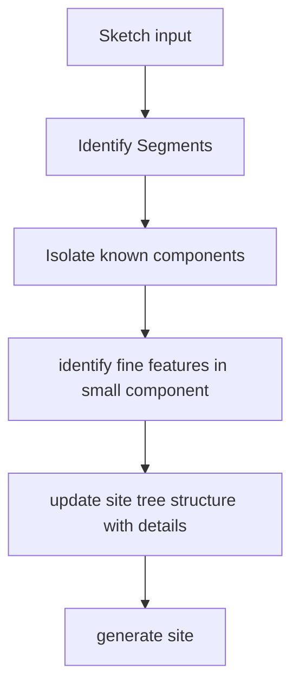

# Review 1

The project is being built under the guidance of Prof. Nitin Singh Rajput. The entire development of the project is done online, using github to manage its various components and to utilize version control features.

All the codebase is being regularly updated here : [github.com/Sketch2Site](https://github.com/Sketch2Site) and frequent blog posts about it are published on [sketch2site.github.io](https://sketch2site.github.io/)

## Team Members
- [Yash Kumar Verma](https://github.com/yashkumarverma/) / 19BCE2669

## Problem Statement

## Intro about domain
We're using Computer Vision Technology to analyze the hand-made sketches and extract features from them. This allows users to customize their requirements the way they want.

Next, we are using image libraries for image processing to further customize and analyze the input image finetune the output.

Finally, once we have created a tree of the image, we use a custom-written code generator to produce a site.

## Intro about AI part

### Computer Vision:
Computer vision is an interdisciplinary scientific field that deals with how computers can gain high-level understanding from digital images or videos. From the perspective of engineering, it seeks to understand and automate tasks that the human visual system can do.

The most established algorithm among various deep learning models is a convolutional neural network (CNN), a class of artificial neural networks that have been a dominant method in computer vision tasks since the astonishing results were shared on the object recognition competition known as the ImageNet Large Scale Visual Recognition Competition.

CNN is a type of deep learning model for processing data that has a grid pattern, such as images, which is inspired by the organization of the animal visual cortex and designed to automatically and adaptively learn spatial hierarchies of features, from low- to high-level patterns.

We're using OpenCV to identify patterns in the image to fine-tune the sketch analysis.

## Motivation
In the current world scenario where all things have become online, it has become a necessity to have an online presence, but in a developing country like India where there is a significant population completely alien to web technologies. Many of them can't even afford to hire professional developers to get their business online.

We're building this project to empower the people at the end of the spectrum to have an online presence, quickly prototype their expectations in the form of websites.

The use-case of this project also finds its place in the lives of professional developers who are constantly prototyping sites for their clients.

## Flow

## Work Plan
- Generating Datasets for various components for model [7 days]
- Understanding working of AI models (CNN for Computer Vision) and creating small mini-projects [7 days]
- Creating AI Model to identify the above components and generate site-structure tree [30 days]
- Write Image processing scripts using OpenCV to fine-tune site structure tree [30 days]
- Write code generator to convert model output into Site [14 days]

## Literature Review
- Research article on [Computer Vision](https://dl.acm.org/doi/10.5555/1074100.1074274)
- Research article on [Computer Vision Applications](https://dl.acm.org/doi/10.1145/175247.175251)
- Research article on [Computer Vision: Deep Dive into Object Segmentation Approaches](https://dl.acm.org/doi/10.1145/3394486.3406710)
- Research article on [Real-time computer vision with OpenCV](https://dl.acm.org/doi/10.1145/2184319.2184337)
- Research article on [Constraint-based code generation](https://dl.acm.org/doi/10.1145/2463596.2486155)
- Research article on [Computer vision techniques and applications in human-computer interaction](https://dl.acm.org/doi/10.1145/1027933.1028011)

